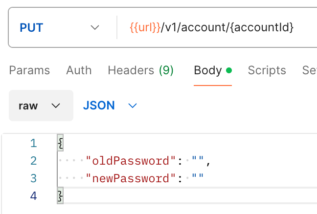
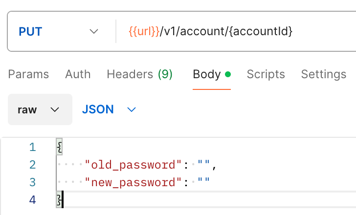
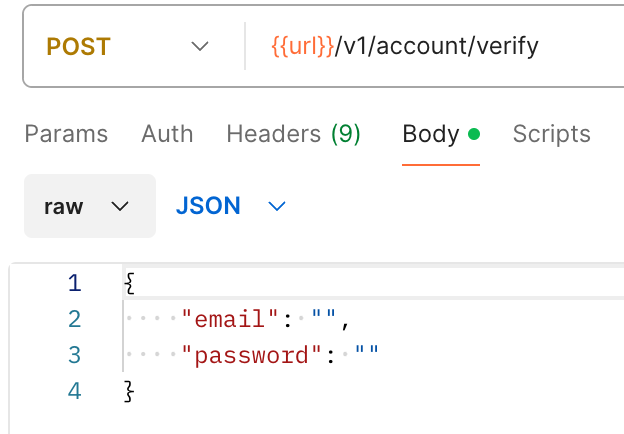
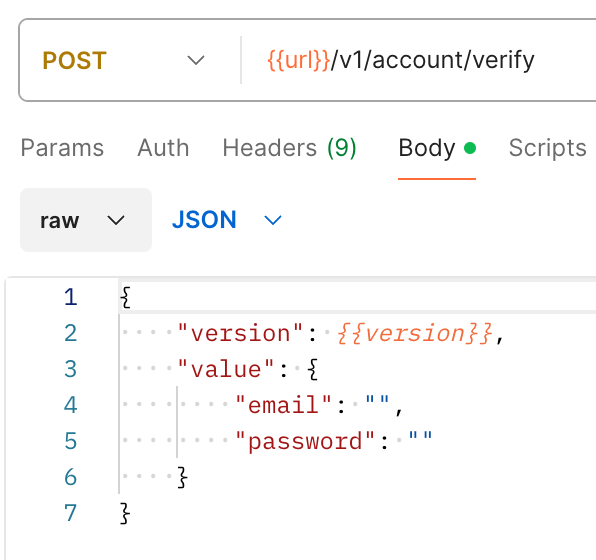
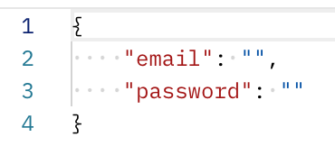
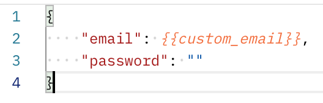
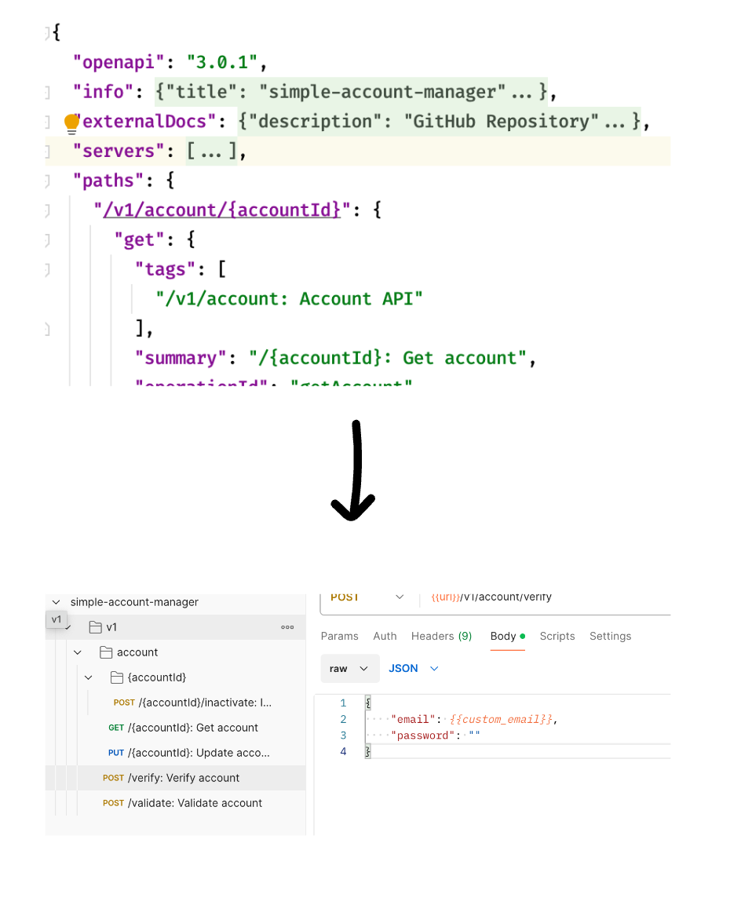

## Summary

이 프로젝트는 Open API 3.0 스펙을 여러 데이터 형태로 변환할 수 있는 라이브러리 입니다.

---

## 설치

```shell

# Git 클론
git clone https://github.com/mr-alloc/openapi-resource-converter.git
cd openapi-resource-converter

# 의존성 설치
npm install # or yarn install


# Typescript 컴파일
npm run build # or yarn build

# bin 설정을 위한 권한부여
chmod +x dist/index.js

# 전역 설치
npm link # or yarn link

# 명령어 실행
orc postman -f <openapi json file path> -o <output file path>

#링크가 잘못 적용 된 경우 링크 삭제
npm unlink -g orc # or yarn unlink -g orc
```

## 옵션

### postman

postman 명령어는 OpenAPI 3.0 스펙을 Postman Collection v2.1 스펙으로 변환합니다.

* -f, --file : OpenAPI 3.0 스펙 JSON 파일 경로 (필수)
* -o, --output : 변환된 JSON 파일 경로 (필수)
* -c, --config : 변환 설정(yaml) 파일 경로 (선택)

포스트맨 컬렉션 변환 설정 파일은 다음과 같은 형식으로 작성합니다.

```yaml
postman:
  ...
```

*호스트 지정*
포스트맨 요청생성시 사용할 호스트를 지정합니다.
```yaml
postman:
  host: "http://{{url}}" # 기본값: "{{url}}"
```

*파라미터 키 케이스 설정*
파라미터 키의 케이스를 설정합니다.
사용 가능값: [`camel`, `snake`]
```yaml
postman:
  case: snake # 기본값: camel
```

*제외 경로 설정*
변환에서 제외할 경로를 설정합니다.
```yaml
postman:
  excludePaths:
    - "/foo/*/move"
    - "/bar/internal/**"
    - "/"
```

*기본 헤더 추가*
모든 요청에 추가할 기본 헤더를 설정합니다.
```yaml
postman:
  headers:
    Authorization: "Bearer {{token}}"
    Content-Type: application/json
```

*플레이스홀더 설정*
변환된 요청에 사용할 플레이스홀더를 설정합니다.
포맷은 타입에따라 자동으로 적용됩니다.
```yaml
postman:
  placeholders:
    userId: "uid"
```
결과:
```text
{
  "userId": {{uid}}, // 숫자형인 경우
  "userId": "{{uid}}" // 문자열인 경우
}
```


## 사용법

```typescript
import OpenApiParser from "@/parser/OpenApiParser";
import PostmanCollectionConverter from "@/converter/postman/PostmanCollectionConverter";
import PostmanConvertConfigures from "@/converter/postman/PostmanConvertConfigures";
import CaseMode from "@/type/postman/constant/CaseMode";
import {writeNewFile} from "@/util/FileUtil";

const openAPISpecification = OpenApiParser.parse('./resources/openapi.json');
const configures = new PostmanConvertConfigures("{{url}}", CaseMode.CAMEL); 
const converter = new PostmanCollectionConverter(openAPISpecification, configures);

const path = `${process.cwd()}/static/postman.json`
const converted = converter.convert();
writeNewFile(path, JSON.stringify(converted, null, 2));
```

---

## Options

### Choose case mode for key of parameters
```typescript
const configures = new PostmanConvertConfigures("{{url}}", CaseMode.SNAKE); 
```

#### As is


#### To be



### Exclude Path
```typescript
configures.addExcludePaths(["/foo", "/bar", "/"]);
```
This options will be support for excluding as a using asterisk soon.

### Wrapping Request Body
```typescript
configures.defaultBodyWrapper((path, method, body) => {
    return {
        version: "{{version}}",
        value: body
    } as IPostmanRequestBody;
});
```

#### As is


#### To be



### Add Placeholders

```typescript
configures.addPlaceholders(new Map<string, any>([
    ['email', 'custom_email'],
]))
```

#### As is


#### To be


---

## Convert your openapi spec right now!!

